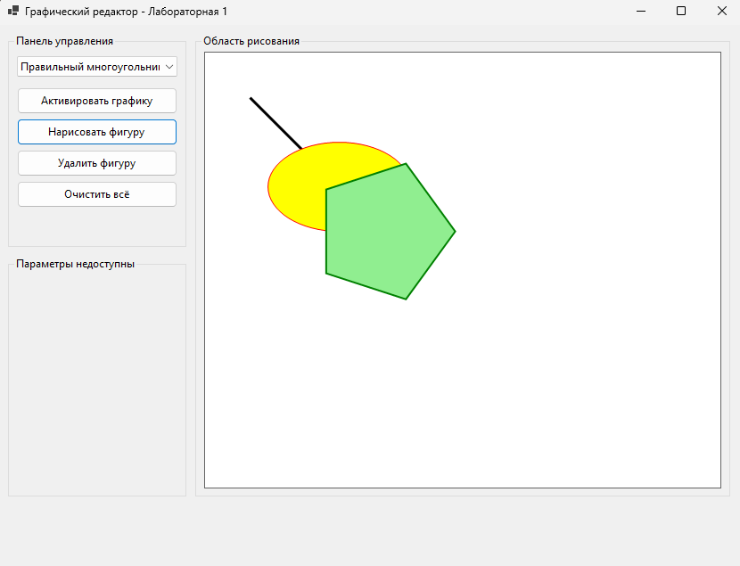

# Лабораторная работа 1

## Задание

Нужно было сделать программу для рисования простых фигур. Программа должна уметь рисовать линии, эллипсы и многоугольники, а также стирать их.

## Что я сделала

Я сделала программу на Windows Forms, которая может рисовать разные фигуры:

1. **Линия** - можно нарисовать отрезок с заданными началом и концом
2. **Эллипс** - рисуется овал с заливкой и подписью
3. **Правильный многоугольник** - автоматически вычисляются вершины по количеству сторон
4. **Произвольный многоугольник** - можно задать вершины вручную

## Результат работы программы

## Как работает программа

В программе есть три основные части:
- Панель управления с кнопками
- Область для рисования
- Панель настроек (появляется для произвольного многоугольника)

Чтобы нарисовать фигуру:
1. Выбираю тип фигуры из списка
2. Нажимаю кнопку "Нарисовать фигуру"
3. Фигура появляется на экране

Для произвольного многоугольника нужно сначала добавить вершины через поля ввода координат.

## Структура проекта

Файлы разложены по папкам:

- **Forms/** - главная форма программы (GraphicsForm.cs)
- **Shapes/** - классы фигур (LineShape, EllipseShape, PolygonShape) и интерфейс IShape
- **Utils/** - вспомогательные классы (DrawingCanvas, ShapeFactory, UIHelper)

## Технические детали

Все фигуры реализуют интерфейс IShape, у которого есть два метода:
- Render() - для рисования
- Remove() - для стирания

Рисование происходит через событие Paint панели. Все фигуры хранятся в списке, и при перерисовке они все отрисовываются заново.

Я использовала классы из System.Drawing:
- Graphics для рисования
- Pen для контуров
- SolidBrush для заливки

## Запуск

Нужно установить .NET SDK 8.0 или выше, потом запустить через `dotnet run` или файл `run.bat`.

## Результат

Все требования выполнены:
- Сделаны классы для всех типов фигур
- У каждой фигуры есть методы рисования и стирания
- Линия настраивается по толщине и стилю
- Эллипс можно заливать и подписывать
- Многоугольники работают как правильные, так и произвольные
- Есть интерфейс с кнопками управления
