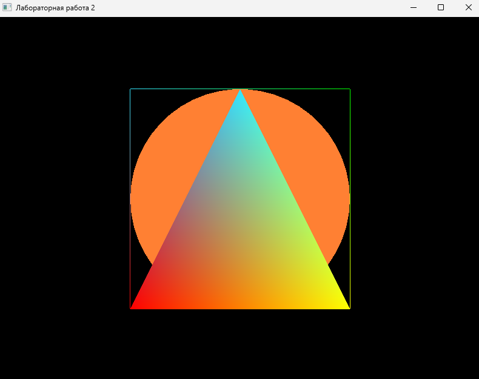

# Лабораторная работа 2

## Задание

Нужно было сделать программу для рисования простых фигур в OpenGL. Программа должна уметь рисовать треугольник, квадрат и круг используя библиотеку OpenTK.

## Что я сделала

Я сделала программу на OpenTK, которая рисует три фигуры:

1. **Треугольник** - рисуется с разными цветами для каждой вершины
2. **Квадрат** - рисуется контуром с цветными вершинами
3. **Круг** - рисуется как многоугольник с большим количеством сторон

## Результат работы программы

## Как работает программа

Программа открывает окно с OpenGL контекстом и рисует все фигуры одновременно. Фигуры отображаются в 3D пространстве, но все находятся на одной глубине.

Для выхода из программы нужно нажать клавишу Escape.

## Структура проекта

Файлы разложены по папкам:

- **MainWindow.cs** - главное окно приложения, управляет жизненным циклом программы
- **Shapes/** - классы фигур (Triangle, Square, Circle)
- **Renderers/** - класс для рисования фигур через OpenGL (ShapeRenderer)
- **Utils/** - вспомогательные функции для настройки OpenGL (OpenGLHelper)

## Технические детали

Все фигуры имеют метод Render(), который рисует их на экране. Рисование происходит через OpenGL примитивы:

- Triangle использует PrimitiveType.Triangles для заливки
- Square использует PrimitiveType.LineLoop для контура
- Circle использует PrimitiveType.Polygon и рисуется как многоугольник с 50 сторонами

Для настройки OpenGL я использовала:
- Matrix4.LookAt для настройки вида камеры
- Matrix4.CreatePerspectiveFieldOfView для перспективной проекции
- GL.Begin/GL.End для рисования примитивов
- GL.Color3 и GL.Vertex3 для задания цвета и координат вершин

## Запуск

Нужно установить .NET SDK 8.0 или выше. Также нужны библиотеки OpenTK из папки libs в корне проекта. Запуск через `dotnet run` в папке lab2.

## Результат

Все требования выполнены:
- Сделаны классы для треугольника, квадрата и круга
- Использована библиотека OpenTK для работы с OpenGL
- Фигуры рисуются с разными цветами
- Круг рисуется как многоугольник с большим числом сторон
- Код организован по папкам и классам
