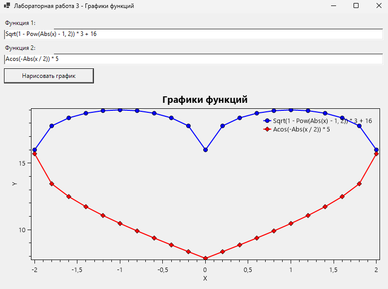

# Лабораторная работа 3

## Задание

Нужно было сделать программу для построения графиков функций. Программа должна уметь парсить математические формулы, введенные пользователем, и рисовать графики этих функций на одном поле.

## Что я сделала

Я сделала программу на Windows Forms, которая может строить графики двух функций одновременно:

1. **Ввод формул** - можно ввести любую математическую формулу с переменной x
2. **Парсинг формул** - программа преобразует строку в математическое выражение
3. **Построение графиков** - рисует графики с разными цветами и маркерами
4. **Настройка осей** - автоматически подписывает оси X и Y

## Результат работы программы

## Как работает программа

В программе есть два поля ввода для формул функций. Можно вводить математические выражения используя функции из библиотеки NCalc:
- Арифметические операции: +, -, *, /
- Степень: Pow(x, 2)
- Квадратный корень: Sqrt(x)
- Тригонометрические функции: Sin(x), Cos(x), Acos(x)
- Модуль: Abs(x)
- И другие

После ввода формул нужно нажать кнопку "Нарисовать график", и программа построит оба графика на одном поле. Графики отображаются разными цветами и с разными маркерами в точках.

## Структура проекта

Файлы разложены по папкам:

- **Program.cs** - точка входа в программу
- **Forms/GraphForm.cs** - главная форма с интерфейсом
- **Parsers/FormulaParser.cs** - класс для парсинга и вычисления формул
- **Utils/GraphBuilder.cs** - класс для построения графиков

## Технические детали

Для парсинга формул я использовала библиотеку NCalc. Она позволяет преобразовать строку с формулой в математическое выражение и вычислить его значение для разных x.

Для построения графиков использовала библиотеку OxyPlot. Она позволяет:
- Создавать серии точек для графиков
- Настраивать цвета и маркеры
- Добавлять оси с подписями
- Отображать легенду

Программа вычисляет значения функций для x от -5 до 5 с шагом 0.2. Если в какой-то точке функция не может быть вычислена (например, деление на ноль), эта точка пропускается.

## Запуск

Нужно установить .NET SDK 8.0 или выше. Также нужны библиотеки NCalc, OxyPlot и OxyPlot.WindowsForms из папки libs в корне проекта. Запуск через `dotnet run` в папке lab3.

## Результат

Все требования выполнены:
- Сделана программа для построения графиков функций
- Реализован парсинг формул из строки
- Графики рисуются с разными цветами и маркерами
- Оси подписаны и настроены
- Можно строить несколько графиков одновременно
- Код организован по папкам и классам
