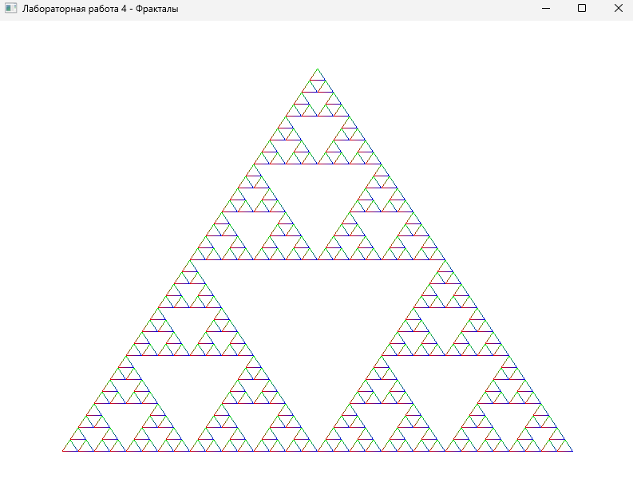

# Лабораторная работа 4

## Задание

Нужно было сделать программу для рисования фракталов. Фрактал - это геометрическая фигура, которая имеет самоподобие на разных масштабах. То есть если увеличить часть фрактала, она будет похожа на весь фрактал.

## Что я сделала

Я сделала программу на OpenTK, которая рисует два фрактала:

1. **Треугольник Серпинского** - строится рекурсивным делением треугольника на три меньших треугольника
2. **Множество Мандельброта** - строится итерациями комплексных чисел (закомментировано, но можно включить)

## Результат работы программы

## Как работает программа

Программа открывает окно с OpenGL контекстом и рисует фрактал. По умолчанию рисуется треугольник Серпинского с глубиной рекурсии 5.

Для выхода из программы нужно нажать клавишу Escape.

### Треугольник Серпинского

Этот фрактал строится так:
1. Берем обычный треугольник
2. Находим середины всех его сторон
3. Соединяем середины - получаем четыре треугольника
4. Центральный треугольник убираем
5. Для каждого из трех оставшихся треугольников повторяем процесс

Чем больше глубина рекурсии, тем детальнее получается фрактал.

### Множество Мандельброта

Этот фрактал строится итерациями комплексных чисел. Для каждой точки на плоскости вычисляется, принадлежит ли она множеству Мандельброта. Цвет точки зависит от того, сколько итераций потребовалось, чтобы определить это.

## Структура проекта

Файлы разложены по папкам:

- **MainWindow.cs** - главное окно приложения, управляет жизненным циклом программы
- **Fractals/** - классы фракталов (SierpinskiTriangle, MandelbrotSet)
- **Utils/** - вспомогательные функции для настройки OpenGL (OpenGLHelper)

## Технические детали

Треугольник Серпинского рисуется рекурсивно. Функция DrawSierpinski вызывает сама себя три раза для трех меньших треугольников. Когда глубина рекурсии достигает нуля, рисуется треугольник с цветными вершинами.

Множество Мандельброта рисуется через итерации формулы z = z² + c, где z начинается с 0, а c - координаты точки на комплексной плоскости. Если после определенного количества итераций |z| остается меньше 2, точка принадлежит множеству.

Для рисования использовала OpenGL примитивы:
- LineLoop для треугольника Серпинского
- Points для множества Мандельброта

## Запуск

Нужно установить .NET SDK 8.0 или выше. Также нужны библиотеки OpenTK из папки libs в корне проекта. Запуск через `dotnet run` в папке lab4.

## Результат

Все требования выполнены:
- Сделана программа для рисования фракталов
- Реализован треугольник Серпинского с рекурсивным алгоритмом
- Реализовано множество Мандельброта (можно включить в коде)
- Фракталы рисуются через OpenGL
- Код организован по папкам и классам
