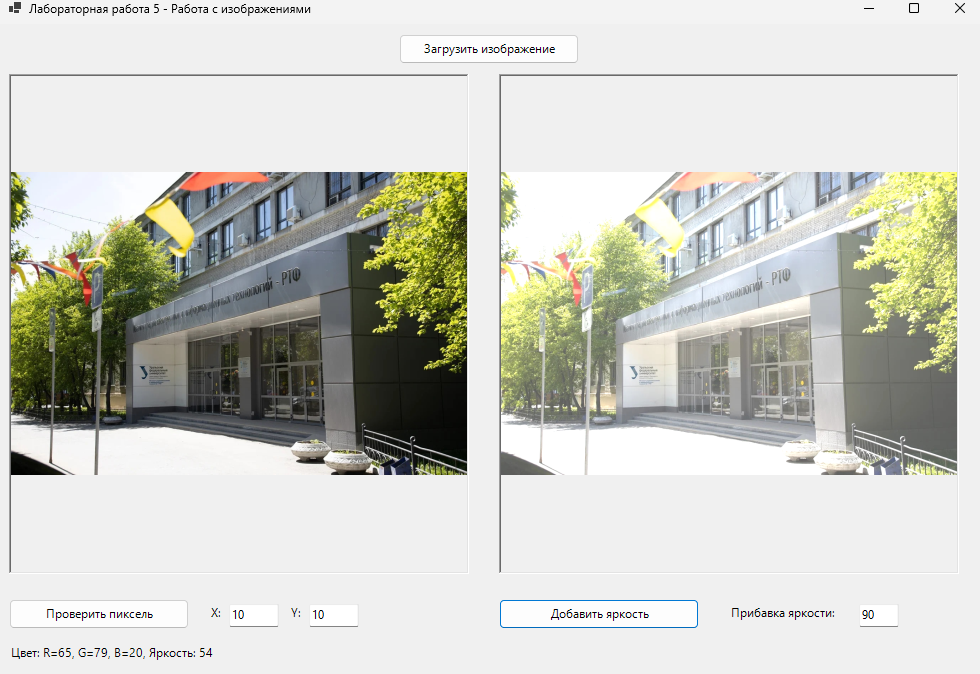

# Лабораторная работа 5

## Задание

Нужно было сделать программу для работы с изображениями. Программа должна уметь загружать изображения, получать информацию о пикселях и изменять яркость изображения.

## Что я сделала

Я сделала программу на Windows Forms, которая может:

1. **Загружать изображения** - можно выбрать файл в форматах BMP, JPG, PNG
2. **Проверять пиксели** - можно ввести координаты и узнать цвет и яркость пикселя
3. **Изменять яркость** - можно изменить яркость всего изображения на заданное значение

## Результат работы программы



## Как работает программа

В программе есть два окна для отображения изображений:
- Слева показывается исходное изображение
- Справа показывается модифицированное изображение

Чтобы загрузить изображение, нужно нажать кнопку "Загрузить изображение" и выбрать файл.

Чтобы проверить пиксель, нужно:
1. Ввести координаты X и Y в поля ввода
2. Нажать кнопку "Проверить пиксель"
3. Внизу появится информация о цвете (R, G, B) и яркости пикселя

Чтобы изменить яркость изображения:
1. Ввести значение прибавки яркости (может быть отрицательным для затемнения)
2. Нажать кнопку "Добавить яркость"
3. Модифицированное изображение появится справа

## Структура проекта

Файлы разложены по папкам:

- **Program.cs** - точка входа в программу
- **Forms/MainForm.cs** - главная форма с интерфейсом
- **Processors/ImageProcessor.cs** - класс для обработки изображений
- **Utils/ImageHelper.cs** - вспомогательные функции для работы с пикселями

## Технические детали

Для работы с изображениями я использовала класс Bitmap из System.Drawing. Он позволяет:
- Загружать изображения из файлов
- Получать цвет пикселя по координатам через GetPixel
- Устанавливать цвет пикселя через SetPixel

Яркость вычисляется как среднее значение красного, зеленого и синего каналов:
```
Яркость = (R + G + B) / 3
```

При изменении яркости к каждому каналу добавляется заданное значение, но результат ограничивается диапазоном от 0 до 255, чтобы цвета не выходили за допустимые пределы.

Программа проходит по всем пикселям изображения и изменяет их яркость. Это может занять некоторое время для больших изображений.

## Запуск

Нужно установить .NET SDK 8.0 или выше. Запуск через `dotnet run` в папке lab5.

## Результат

Все требования выполнены:
- Сделана программа для работы с изображениями
- Реализована загрузка изображений в разных форматах
- Реализовано получение информации о пикселях по координатам
- Реализовано изменение яркости изображения
- Исходное и модифицированное изображения отображаются рядом
- Код организован по папкам и классам
