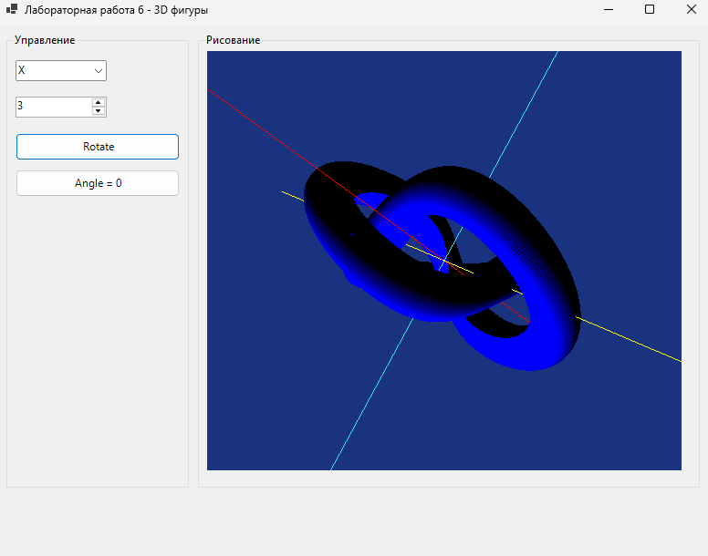

# Лабораторная работа 6

## Задание

Нужно было сделать программу для рисования 3D фигур в OpenGL. Программа должна уметь рисовать различные геометрические объекты и позволять вращать их вокруг осей координат.

## Что я сделала

Я сделала программу на Windows Forms с OpenGL, которая может:

1. **Рисовать 3D фигуры** - различные геометрические объекты (куб, цилиндр, конус, усеченная пирамида, параметрические поверхности)
2. **Вращать фигуры** - можно поворачивать объекты вокруг осей X, Y и Z
3. **Отображать координатные оси** - для ориентации в 3D пространстве

## Результат работы программы

## Как работает программа

В программе есть две области:
- Слева - панель управления с кнопками и полями ввода
- Справа - область для отображения 3D фигур

Чтобы повернуть фигуру:
1. Выбрать ось вращения (X, Y или Z) из выпадающего списка
2. Ввести угол поворота в поле ввода
3. Нажать кнопку "Rotate"
4. Фигура повернется на заданный угол вокруг выбранной оси

Кнопка "Angle = 0" сбрасывает все углы поворота.

По умолчанию рисуется поверхность трилистника (trefoil surface) - это красивая параметрическая поверхность. В коде можно раскомментировать другие фигуры для отображения.

## Структура проекта

Файлы разложены по папкам:

- **Program.cs** - точка входа в программу
- **Forms/MainForm.cs** - главная форма с интерфейсом и GLControl
- **Renderers/FigureRenderer.cs** - класс для рисования различных 3D фигур
- **Utils/OpenGLHelper.cs** - вспомогательные функции для настройки OpenGL

## Технические детали

Для работы с 3D графикой я использовала OpenTK с GLControl. GLControl - это компонент Windows Forms, который позволяет встраивать OpenGL в обычное приложение.

Для рисования фигур используются различные примитивы OpenGL:
- Points - точки
- Lines - линии
- LineLoop - замкнутая линия
- Quads - четырехугольники
- Triangles - треугольники

Поворот фигур реализован через функции GL.Rotate, которые применяют матрицы поворота вокруг осей координат. Углы накапливаются, так что можно поворачивать фигуру несколько раз подряд.

Камера настроена так, чтобы смотреть на центр координат с позиции (-300, 300, 200). Используется перспективная проекция для правильного отображения 3D объектов.

## Запуск

Нужно установить .NET SDK 8.0 или выше. Также нужны библиотеки OpenTK из папки libs в корне проекта. Запуск через `dotnet run` в папке lab6.

## Результат

Все требования выполнены:
- Сделана программа для рисования 3D фигур
- Реализовано вращение фигур вокруг осей координат
- Реализованы различные геометрические объекты
- Отображаются координатные оси
- Есть интерфейс для управления
- Код организован по папкам и классам
