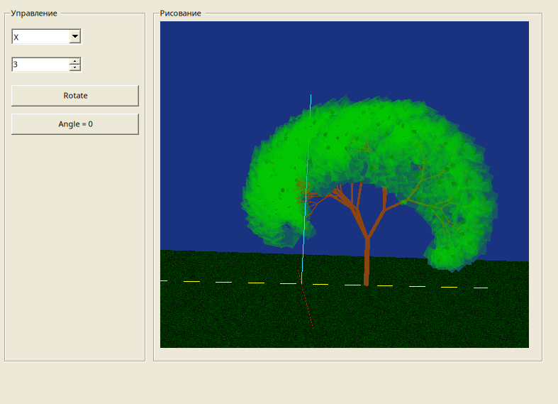

# Лабораторная работа 7

## Задание

Нужно было сделать программу для рисования 3D дерева в OpenGL. Программа должна уметь рисовать дерево рекурсивно, управлять камерой с помощью клавиатуры и мыши, а также отображать текстурированную землю.

## Что я сделала

Я сделала программу на Windows Forms с OpenGL, которая может:

1. **Рисовать 3D дерево** - дерево строится рекурсивно из цилиндров (ствол и ветки)
2. **Управлять камерой** - можно перемещаться с помощью клавиатуры (WASD, QE) и поворачивать камеру мышью
3. **Отображать текстурированную землю** - сетка из текстур травы
4. **Вращать сцену** - можно поворачивать всю сцену вокруг осей координат

## Результат работы программы

## Как работает программа

В программе есть две области:
- Слева - панель управления с кнопками и полями ввода
- Справа - область для отображения 3D сцены

### Управление камерой

- **W, S** - движение вперед/назад
- **A, D** - движение влево/вправо
- **Q, E** - движение вверх/вниз
- **Левая кнопка мыши + движение** - поворот камеры

### Вращение сцены

- Выбрать ось вращения (X, Y или Z) из выпадающего списка
- Ввести угол поворота в поле ввода
- Нажать кнопку "Rotate"
- Кнопка "Angle = 0" сбрасывает все углы

## Структура проекта

Файлы разложены по папкам:

- **Program.cs** - точка входа в программу
- **Forms/MainForm.cs** - главная форма с интерфейсом и GLControl
- **Models/TreeGenerator.cs** - генерация и рисование дерева
- **Models/TreeModel.cs** - структура данных для сегментов дерева
- **Renderers/FigureRenderer.cs** - класс для рисования фигур и текстур
- **Controllers/CameraController.cs** - управление камерой
- **Utils/OpenGLHelper.cs** - вспомогательные функции для настройки OpenGL
- **Utils/TextureLoader.cs** - загрузка текстур из файлов

## Технические детали

Дерево строится рекурсивно:
1. Рисуется ствол (цилиндр)
2. На вершине ствола создаются ветки (тоже цилиндры, но меньше)
3. На каждой ветке рекурсивно создаются новые ветки
4. На последнем уровне рисуются листья (кубики зеленого цвета)

Каждый уровень имеет меньший радиус и высоту, что создает эффект сужения к вершине.

Для управления камерой используется класс CameraController, который обрабатывает нажатия клавиш и движение мыши. Камера может перемещаться в 3D пространстве и поворачиваться в любом направлении.

Текстура земли загружается из файла grass.jpg и отображается в виде сетки квадратов. Каждый квадрат имеет координаты текстуры для правильного отображения.

## Запуск

Нужно установить .NET SDK 8.0 или выше. Также нужны библиотеки OpenTK из папки libs в корне проекта. Для работы программы нужен файл grass.jpg в корне проекта (текстура для земли). Запуск через `dotnet run` в папке lab7.

## Результат

Все требования выполнены:
- Сделана программа для рисования 3D дерева
- Реализовано рекурсивное построение дерева из цилиндров
- Реализовано управление камерой с клавиатуры и мыши
- Реализована текстурированная земля
- Есть возможность вращения сцены
- Код организован по папкам и классам
